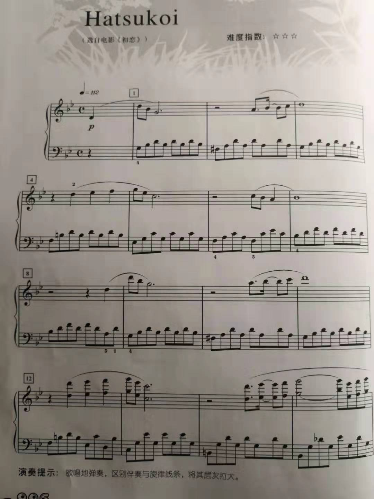
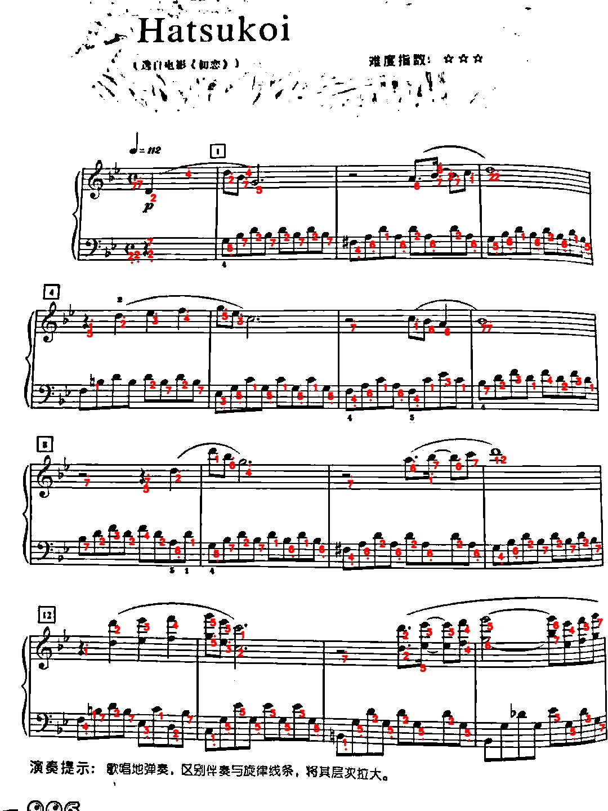

# Piano-Score-to-Numbered-Score-Converter
Takes in a photo of piano score, outputs a jpg file. A number accompany each note. 

Download the ScoreFINAL.py final, replace "test.jpeg" with the image path you want. For example, if the image is in the your desktop, you should replace something similar to "Desktop/imageName.imageExtension", if you placed the image in the same folder as ScoreFINAL.py, just replace "imageName.imageExtension".

You will see an output jpg file in the same directory as the one you placed ScoreFINAL.py in. 

For better results, play around the parameters in the ScoreFINAL.py file. 

For example, input image "test.jpeg"

Get "output.jpg"

